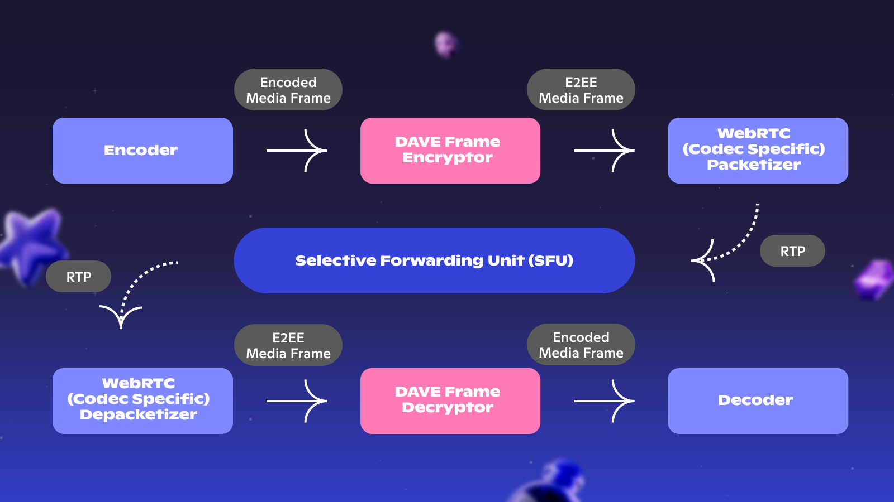

# Introduction

This document details protocol version 1.0 of Discord’s audio/video end-to-end encryption (DAVE) protocol.

Beginning September 2024, supporting Discord clients prefer to use end-to-end encryption for DM/GDM calls, server voice channels (excluding stage channels), and Go Live streams. In 2025 all official Discord clients will support the protocol and it will be an enforced requirement to connect to the end-to-end encryption eligible audio/video session types listed above.

This document uses the TLS presentation language [[RFC8446]](https://www.rfc-editor.org/info/rfc8446) with the Messaging Layer Security (MLS) Protocol additional features for [Optional Value](https://www.rfc-editor.org/rfc/rfc9420.html#section-2.1.1) and [Variable-Size Vector Length Headers](https://www.rfc-editor.org/rfc/rfc9420.html#section-2.1.2).

This document is licensed under [CC BY-NC-SA 4.0](https://creativecommons.org/licenses/by-nc-sa/4.0/).

# Terms

**E2EE**  
End-to-end encryption

**WebRTC**  
Open-source API for real-time communication, widely supported by major browsers

**Real-time transport protocol (RTP)**  
Network protocol for delivery of audio and video over IP networks

**Media Session**  
Time-delimited audio and video activity on the Discord platform (e.g.: DM/GDM call, Go Live stream, server voice channel)

**Messaging Layer Security (MLS)**  
Underlying group key exchange protocol leveraged by the the DAVE protocol

**Voice Gateway**  
Discord’s existing RTC signaling/coordination service, websocket server for media session clients

**Selective Forwarding Unit (SFU)**  
Discord service that relays RTP audio and video traffic between media session members

# Overview

In E2EE eligible Discord media sessions, the voice gateway selects an appropriate DAVE protocol version for the media session members.

The media session members undergo a group key exchange via MLS, facilitated by the voice gateway acting as the MLS delivery and authentication services. Once the media session MLS group is established, members export a ratcheted per-sender symmetric media encryption key for each media sender (including themselves). When the media session participant list changes, the voice gateway facilitates a transition to the next MLS group epoch and media session members export new ratcheted media keys for all senders in the new group.

Using the WebRTC encoded transform API, media senders encrypt encoded audio or video frames with their ratcheted symmetric sender key extracted from the MLS group. The encrypted frame returned by the send-side frame transformer is then packetized by WebRTC to one or more RTP packets. These RTP packets, each carrying a full E2EE frame or a subsection of an E2EE frame, are sent to the SFU to be broadcast to other media session members. The receive-side WebRTC depacketizer reconstructs the E2EE frame from RTP packets before delivering it to the receive-side frame transformer. The receive-side frame transformer uses the sender’s ratcheted symmetric sender key to decrypt the E2EE frame and return the decrypted encoded frame to WebRTC.

# Threat Model

Our goal in offering end-to-end encryption of voice and video is to provide the best security protections, primarily against passive and active eavesdroppers, across all devices that Discord currently operates (web, mobile, consoles, and our Desktop clients), while being mindful of the constraints that each environment imposes.

We aim to defend against a wide array of adversaries, in particular:

- **Insiders:** Discord employees and those who do work on our behalf, who maintain our cloud infrastructure, or otherwise have any kind of privileged access to our systems (or the means to compel those who have such access).
- **Outsiders:** Those who do not have privileged access to Discord’s systems and are otherwise unauthorized to participate in a particular encrypted call, and do not possess any non-public information about a particular encrypted call (e.g., credentials for a participant in the call). These adversaries may eavesdrop, intercept, replay, and modify network traffic.
- **Participants:** Those who are actively participating in an end-to-end encrypted call, or have the means to actively participate in an end-to-end encrypted call (e.g., former and future participants who posses an active invite to the call or who have left and can re-join).

## Security Goals

Against these kinds of adversaries, working in collusion or independently, we specifically seek to provide:

- **Confidentiality:** Only active and authorized participants should have access to the contents of end-to-end encrypted calls. Once a participant has left or otherwise been removed from the end-to-end encrypted call, they should no longer have access to further communications. When a participant joins a call, they do not have access to communiciations occuring prior to them joining.
- **Integrity:** Those who are not active participants should not have the ability to surreptitiously corrupt (tamper, forge, nor replay) end-to-end encrypted calls.
- **Authenticity**: Participants should be able to clearly identify each other, and have sufficient information to trust that they are communicating with the participants that they expect.

## Limitations

Our threat model is primarily built around defending against passive and active eavesdroppers. As such, there are some attacks and threats which we explicitly deem out of scope for our efforts.

- **Metadata disclosure:** Insiders and outsiders may be able to observe or obtain metadata about a call (e.g., existence, participants, duration, usage patterns, etc) that are necessary to provide the service.
- **Software flaws and compromise:** The software that Discord provides or third-party code that Discord uses may contain vulnerabilities. Discord relies on modern secure software development practices (including its vulnerability management program which audits our supply chain), third party auditing, and the open sourcing of select components to mitigate these risks.
- **Device compromise:** If a participant’s underlying device is compromised, we cannot make any guarantees as to the authenticity of their actions. We define “compromised” as an adversary obtaining the user’s credentials or obtaining code execution in a same-user context as the Discord application.
- **Denial of service:** We cannot offer guarantees about availability beyond what the service itself can support. Moreover, insider adversaries always have the ability to deny service to particular users.

# Protocol Version Negotiation

When connecting to an E2EE eligible media session, each Discord client will present their highest supported DAVE protocol version to the voice gateway in the [identify opcode (0)](#identify-0).

Discord clients must continue to support all available and deprecated protocol versions below their highest supported version. Deprecated DAVE protocol versions may be discontinued after a notice period. Once discontinued, the voice gateway will reject connections from members that do not support an active or deprecated protocol version. Support for discontinued protocol versions can be removed from clients.

The voice gateway is responsible for selecting the appropriate protocol version for the media session. The initial protocol version is returned to connecting clients in the [select_protocol_ack opcode (4)](#select_protocol_ack-4).

When the member list of the media session changes, the protocol version may change (see [Protocol Version Changes](#protocol-version-changes)).

During the initial transitory phase where some clients will not support any DAVE protocol versions, the voice gateway will facilitate upgrade or downgrade between transport encryption and E2EE (see [Initial Transitory Phase](#initial-transitory-phase)).

First-party clients display when a media session is end-to-end encrypted and when it is not. During the initial transitory phase this status may change during the media session.

### Protocol Version Changes

It is possible to transition between protocol versions while maintaining an E2EE session. This may require the creation of a new MLS group, require a commit and epoch transition for the existing established MLS group, or may require no MLS group or epoch changes at all.

The voice gateway sends a [dave_protocol_prepare_epoch opcode (24)](#dave_protocol_prepare_epoch-24) to announce the protocol version change.

When the MLS group is to remain unchanged, the announced epoch in the [dave_protocol_prepare_epoch opcode (24)](#dave_protocol_prepare_epoch-24) will be the current epoch.

When the MLS group must be re-created, this message will carry an `epoch` of 1. Upon receiving a [dave_protocol_prepare_epoch opcode (24)](#dave_protocol_prepare_epoch-24) with an `epoch = 1`, the client must generate and send a new key package to the voice gateway. The voice gateway then follows the usual negotiation process for MLS group creation (described in [Initial Group Creation](#initial-group-creation)).

Once all clients are ready for the protocol change they this report to the voice gateway using the [dave_protocol_ready_for_transition opcode (23)](#dave_protocol_ready_for_transition-23). When the MLS group is being re-created or moving to a new epoch, clients report that they are ready for the transition after processing the commit. When the MLS group is retained, clients report that they are ready for the transition once they prepare their receiving frame decryptors for the protocol version to be used for the given transition ID.

After all clients are ready (or after a timeout), the voice gateway announces that the transition should be executed via the [dave_protocol_execute_transition opcode (22)](#dave_protocol_execute_transition-22). Upon receipt of this message, media senders begin using the new protocol version and new key ratchet (if applicable).

Keys used for receiving media in previous epochs are temporarily retained during transition phases, for a period of up to ten seconds, so that media in flight during the transition can be successfully decrypted.

### Initial Transitory Phase

E2EE will later be a requirement for all eligible media sessions on Discord. This will occur after an announced deprecation period. Until this requirement, clients that do not support the protocol can cause a media session to seamlessly “downgrade” to transport-only encryption. When the last unsupporting client disconnects from a media session the remaining members will seamlessly “upgrade” to E2EE.

First-party Discord clients display when the media session is end-to-end encrypted or not.

#### Passthrough Mode

The WebRTC encoded transforms for all incoming and outgoing streams are always active. If the client is in a non-E2EE media session, the encoded transforms use a passthrough mode which allows media frames to be passed back to WebRTC without modification.

Passthrough mode is enabled when the media session is actively using transport-only encryption, or is in the middle of an upgrade or downgrade transition. Only media frames which fail the protocol frame check are passed through (see [Protocol Frame Check](#protocol-frame-check)).

There is an exceptional case described in [Silence Packets](#silence-packets) where a special audio frame synthesized by the SFU can be passed through untransformed even when the receiving encoded transform is NOT in passthrough mode.

#### Upgrade from Transport-Only Encryption

When the participant list of the media session changes to include only clients that support the DAVE protocol, the voice gateway announces that the protocol version is about to change and a new MLS group must be created. This is broadcasted to clients via the [dave_protocol_prepare_epoch opcode (24)](#dave_protocol_prepare_epoch-24) message.

The creation of the MLS group then follows the process described in [Initial Group Creation](#initial-group-creation).

#### Downgrade to Transport-Only Encryption

A downgrade occurs when a non-supporting client joins a call that was previously using the DAVE protocol.

When a downgrade must occur, the voice gateway broadcasts the [dave_protocol_prepare_transition opcode (21)](#dave_protocol_prepare_transition-21) to media session members to announce the upcoming protocol transition to protocol version 0.

Upon receiving this message, clients enable passthrough mode on their receive-side frame transforms and report to the voice gateway via the [dave_protocol_ready_for_transition opcode (23)](#dave_protocol_ready_for_transition-23) that they are ready to complete the transition.

When all downgrading media session members are ready (or after a timeout), the voice gateway announces that the transition can be executed via the [dave_protocol_execute_transition opcode (22)](#dave_protocol_execute_transition-22).

Upon receiving this opcode for a transition to protocol version 0, clients immediately transition their send-side encoded transform to passthrough mode. As in [Protocol Version Changes](#protocol-version-changes), receivers temporarily retain the key ratchets for previous protocol epochs for a period of up to ten seconds, in case frames in-flight before transition execution arrive and require decryption.

# Group Key Exchange

This section describes how DAVE leverages the [MLS protocol](https://www.rfc-editor.org/rfc/rfc9420.html) to perform a group key exchange over the Discord voice gateway. It does not intend to describe the full MLS protocol. That is well handled by the [MLS Protocol RFC](https://www.rfc-editor.org/rfc/rfc9420.html) and our implementation respects the MLS 1.0 protocol except where identified below.

## MLS Parameters

MLS parameters are defined by the DAVE protocol version.

For DAVE protocol version 1:

- MLS protocol version is 1.0
- MLS ciphersuite is DHKEMP256_AES128GCM_SHA256_P256 (MLS ciphersuite 2)
- One group extension: External Senders
  - Includes one external sender for voice gateway to send external proposals for add/remove
- No leaf node extensions
- Allowed credential type for members and external sender is basic only

## Delivery Service

Our MLS delivery service is the media session voice gateway.

The delivery service knows the current epoch of the group, as well as the current members of the group and their leaf node indexes.

### External Sender

The voice gateway must be added as an external sender using the [MLS group extension external_senders](https://www.rfc-editor.org/rfc/rfc9420.html#section-12.1.8.1).

The voice gateway must send its credential and signature public key to all members before the initial MLS group is negotiated or before a new member is added to an existing group. This is done via the [dave_mls_external_sender_package opcode (25)](#dave_mls_external_sender_package-25).

Initial media session members cannot create a group without the external sender. Before joining an existing group, new members must verify that there is exactly one external sender with a credential and signature public key that matches what they received from the voice gateway.

In order to produce valid proposals and perform basic filtering of invalid handshake messages, the voice gateway retains basic MLS group context (group ID, epoch, and MLS ciphersuite) and associates each member with their leaf node index.

## Proposal Handling

Only Add and Remove proposals sent by the voice gateway external sender are allowed MLS proposal types for the DAVE protocol.

The voice gateway broadcasts proposals that clients must append or revoke via the [dave_mls_proposals opcode (27)](#dave_mls_proposals-27).

The voice gateway may delay a [dave_mls_proposals opcode (27)](#dave_mls_proposals-27) to batch multiple MLS proposals for large or busy media sessions.

The voice gateway may revoke in-flight proposals (e.g. when a pending member no longer needs to be added to the group).

The [dave_mls_proposals opcode (27)](#dave_mls_proposals-27) can only be sent from the voice gateway to clients, and not vice-versa. All clients must process any valid proposals they receive. Clients must reject a proposal if it is not one of the allowed proposal types or is not sent by the expected external sender.

If there are one or more cached proposals after processing a [dave_mls_proposals opcode (27)](#dave_mls_proposals-27), committing members must send a commit with an optional welcome message using the [dave_mls_commit_welcome opcode (28)](#dave_mls_commit_welcome-28). The welcome must be included in this message when one or more add proposals were included in the commit.

### Committing Members

To reduce unnecessary voice gateway traffic, only committing members should send commit and welcome messages to the voice gateway. For DAVE protocol version 1.0, all media session members are committing members.

## Commit Handling

The voice gateway broadcasts valid and expected commits received from committing members via the [dave_mls_announce_commit_transition opcode (29)](#dave_mls_announce_commit_transition-29). This message includes the transition ID for the group epoch change and the binary MLS commit message.

Upon successful processing of the received commit the client: replaces their local MLS group state, prepares new sender key ratchets for receiving decryptors, and notifies the voice gateway that they are ready for the associated transition by sending the [dave_protocol_ready_for_transition opcode (23)](#dave_protocol_ready_for_transition-23).

Once all members are ready (or after a timeout), the voice gateway announces that the transition can be executed via the [dave_protocol_execute_transition opcode (22)](#dave_protocol_execute_transition-22). This causes the [Sender Key Derivation](#sender-key-derivation) to extract a new per-sender key ratchet for the latest epoch.

Media receivers temporarily retain the sender key ratchets for previous epochs, for a period of up to ten seconds, to ensure the successful decryption of any media from the previous epoch which is still in-flight.

## Pending member

Group members of an established MLS group are considered pending members when they are connected to the voice gateway but have not yet been welcomed to the group.

During [Initial Group Creation](#initial_group_creation) for an unestablished MLS group, all members are pending.

## Key Packages

Each pending member of an MLS group sends an MLS key package via the [dave_mls_key_package opcode (26)](#dave_mls_key_package-26). The client must send a new key package after any of the following events:

- The voice gateway sends a [select_protocol_ack opcode (4)](#select_protocol_ack-4) that includes a non-zero protocol version
- The voice gateway announces that a group is being created or re-created via the [dave_protocol_prepare_epoch opcode (24)](#dave_protocol_prepare_epoch-24) with `epoch_id = 1`
- The client is reporting an invalid commit or welcome message (see [Recovery from Invalid Commit or Welcome](#recovery-from-invalid-commit-or-welcome))

The voice gateway removes the cached key package for each member once it receives a welcome message for the given key package. A pending group member can replace their key package but cannot simultaneously use multiple key packages.

### Validation

Prior to including a key package in an add proposal, the voice gateway validates the key package.

The leaf node must use a basic credential where the identity bytes are the big endian representation of the user’s 64-bit Discord snowflake user ID. The voice gateway validates that the user ID in the credential matches the authenticated user ID for the session.

The voice gateway requires that the key package lifetime has `not_before` and `not_after` set to the maximum allowed time span (i.e. `not_before = 0, not_after = 2^64 - 1`). Key package lifetimes are not validated by group members.

The voice gateway verifies the key package signature.

## Member Add

After receiving the key package for a pending group member, the voice gateway broadcasts a [dave_mls_proposals opcode (27)](#dave_mls_proposals-27) which includes the external add proposal for the pending group member.

The voice gateway may delay this message to batch multiple MLS proposals in fewer websocket messages, or to finalize committing a previous in-flight add proposal for the same user.

All group members must refuse to process an add proposal for a user that they do not expect to be in the media session (i.e. the user ID in the add proposal was not in a previously received [clients_connect opcode (11)](#clients_connect-11)).

All group members follow the process described in [Proposal Handling](#proposal-handling) and [Commit Handling](#commit-handling) to add the proposed member to the group.

Committing members must include an inline tree in their produced welcome message, so that welcomed members can instantiate their local copy of the group.

### Welcome Handling

Welcomed members directly receive the welcome message encrypted for their key package via the [dave_mls_welcome opcode (30)](#dave_mls_welcome-30).

Upon successful processing of a [dave_mls_welcome opcode (30)](#dave_mls_welcome-30) message, welcomed members report that they are ready for the associated transition by sending the [dave_protocol_ready_for_transition opcode (23)](#dave_protocol_ready_for_transition-23).

Welcomed members are only able to decrypt media sent for epochs that they are a member of. Welcomed members may not be able to immediately decrypt in-flight media, since media senders will continue to use key ratchets from the previous epoch until the transition is executed via the [dave_protocol_execute_transition opcode (22)](#dave_protocol_execute_transition-22). 

## Member Remove

When a member should be removed from the group the voice gateway will broadcast a [dave_mls_proposals opcode (27)](#dave_mls_proposals-27) which includes an external removal proposal for the leaf index to be removed.

Members are proposed to be removed from the group when:

- They disconnect from the voice gateway, either intentionally or due to a severed websocket connection
- They are about to be re-added with a different key package

The voice gateway may delay a removal proposal to batch multiple proposals in fewer websocket messages.

All group members follow the process described in [Proposal Handling](#proposal-handling) and [Commit Handling](#commit-handling) to remove the member from the group.

During transition phases, media is still sent for the previous group's epoch until media senders receive the [dave_protocol_execute_transition opcode (22)](#dave_protocol_execute_transition-22). When the group completes a transition to the new epoch, removed members are no longer able to decrypt media sent in the next or any future epochs (unless they rejoin and become a member of the group again).

This means that removed members can decrypt media sent immediately after they are removed from the group, for a period of time up to roughly two seconds (due to the voice gateway transition timeout and the latency between the voice gateway and clients). 

Though removed members may be able to decrypt media still being sent during the short transition period, they are no longer forwarded that media from the SFU. Discord first-party clients display all members of the media session as long as they remain connected to the voice gateway and may be receiving media from the SFU.

## Initial Group Creation

When the voice gateway does not have an established group, receiving a [dave_mls_key_package opcode (26)](#dave_mls_key_package-26) will broadcast the add proposal to all other pending group members. This follows the process described in [Member Add](#member-add).

A client that joins when there is not an established group receives any already sent in-flight add proposals for existing pending members.

Members create a local group containing themselves as the sole member once they receive the necessary context (external sender credential and public key and DAVE protocol version). The MLS parameters required for the group are defined by the DAVE protocol version (see [MLS Parameters](#mls-parameters)).

When a member with a local group receives a [dave_mls_proposals opcode (27)](#dave_mls_proposals-27), it appends or revokes the included proposals and optionally sends a commit and welcome back to the voice gateway with the [dave_mls_invalid_commit_welcome opcode (31)](#dave_mls_invalid_commit_welcome-31) (see [Commit Handling](#commit-handling)).

If a member receives proposals from the voice gateway while they do not have a local group, the proposals are ignored.

The group is established when the voice gateway broadcasts the first commit and associated welcome message(s) via the [dave_mls_announce_commit_transition opcode (29)](#dave_mls_announce_commit_transition-29) and [dave_mls_welcome opcode (30)](#dave_mls_welcome-30). When the voice gateway broadcasts this message, it updates its local MLS group context to consider the MLS group established. When the client receives either its own commit or a welcome, it updates its local group state and discards all pending state.

### Invalid Groups

To be valid an MLS group must have the expected ciphersuite and extension list for the protocol version (per [MLS Parameters](#mls-parameters)) and must include the external senders extension with one external sender exactly matching that received from the voice gateway via the [dave_mls_external_sender_package opcode (25)](#dave_mls_external_sender_package-25).

The voice gateway may detect an invalid group during its validation of the initial commit and refuse to broadcast that commit.

An invalid group may however not be detected until the first member(s) are welcomed to the group. The welcomed members follow the process described in [Recovery from Invalid Commit or Welcome](#recovery-from-invalid-commit-or-welcome) to report the invalid group and trigger recreation.

## Sole member reset

When only a single member remains in an established group, the voice gateway sends a [dave_protocol_prepare_epoch opcode (24)](#dave_protocol_prepare_epoch-24) with the initial group epoch `epoch = 1` to the sole remaining member. The voice gateway replaces its local view of the MLS group with a new unestablished group.

Clients reset their local group state anytime they receive a [dave_protocol_prepare_epoch opcode (24)](#dave_protocol_prepare_epoch-24) with `epoch = 1`. Per [Key Packages](#key-packages), the sole remaining member generates and sends a new key package upon receipt of this message.

This ensures that no single member retains control of an established group. When future members join the call, a new group is created following the process described in [Initial Group Creation](#initial-group-creation).

## Commit Ordering

Multiple committing members may send commit messages at the same time. It is the responsibility of the voice gateway to pick a winning commit and broadcast that to all members.

The voice gateway broadcasts the first commit it receives for a given epoch. The voice gateway will not broadcast a commit message for a past or future epoch. The voice gateway will not broadcast a commit that it determines to be invalid.

## Voice Gateway Commit Validity

MLS Handshake messages must be sent in plaintext by all members, as an MLS PublicMessage. These messages are still transport-encrypted between members and the voice gateway, but they are not end-to-end encrypted between members. This can leak some metadata, but this is outside of our [Threat Model](#threat-model).

The voice gateway inspects public commit messages. A commit is only valid when:

- It includes one or more proposals references
- It references only proposals of the types add and remove
- It references all unrevoked proposals broadcast in the epoch by the external sender
- It references and includes no other proposals
- It does not modify the credential or signature key of the leaf node that produced the commit

## Client Commit Validity

Clients assume the voice gateway has validated the broadcasted commit to the best of its ability.

The client will refuse to process any commit when it does not have an established group (i.e. a group with epoch > 0) unless that commit exactly matches the commit they produced for their initial local group.

Clients always perform the commit validation outlined by MLS protocol version 1.0.

## Recovery from Invalid Commit or Welcome

If the client receives a welcome or commit they cannot process, they send the [dave_mls_invalid_commit_welcome opcode (31)](#dave_mls_invalid_commit_welcome-31) to the voice gateway to flag the invalid message.

The voice gateway may remove the user that produced the offending commit/welcome message from committing members.

Upon receiving the [dave_mls_invalid_commit_welcome opcode (31)](#dave_mls_invalid_commit_welcome-31), the voice gateway broadcasts a proposal to remove the flagging member from the group. The flagging member is returned to the pending member state. When the voice gateway receives a new key package from this member, it broadcasts an add proposal.

The client receiving the invalid commit or welcome locally resets their MLS state and generates a new key package to be delivered to the voice gateway via [dave_mls_key_package opcode (26)](#dave_mls_key_package-26).

If the [dave_mls_invalid_commit_welcome opcode (31)](#dave_mls_invalid_commit_welcome-31) flag and the new key package are received within the same epoch, it is possible that the same commit will remove the stale representation and add the new representation of the user to the group.

## Key Rotation

The protocol is not concerned with the rotation of leaf node keys for post-compromise security, due to the short-lived and ephemeral nature of media sessions.

To avoid nonce/key collisions in the symmetric key encryption for media frames, a sender media key rotation is required for extremely long epochs. This is handled by ratcheting the sender media key and is described further in the [Key Rotation](#key-rotation) section under [Encoded Frame Transforms](#encoded-frame-transforms).

## Epoch Authenticator

The epoch authenticator is an exported secret from MLS groups. Discord first-party clients display the MLS epoch authenticator for the latest epoch for the main call as well as for any Go Live stream associated with the call (Go Live streams are a separate media session and therefore have separate MLS groups).

Media session members can perform an out-of-band verification of this epoch authenticator to ensure that their view of the group is the same as all other members.

Discord first-party clients display epoch authenticators using the algorithm described in [Displayable Codes](#displayable-codes) with a total code length of 30 digits and a group size of 5.

# Encoded Frame Transforms

Our implementation uses WebRTC’s encoded transform API to transform each audio and video frame to an end-to-end encrypted frame.

The per-epoch per-sender key ratchet that results from the group key exchange is used by the send-side frame encryptor and by the receive-side frame decryptor. The frame decryptor may need to attempt multiple keys when the group is transitioning between epochs.

The frame transformation must encrypt at a minimum all audio or video data in the encoded frame. It should optimistically encrypt as much frame header metadata as possible.

Some frame headers must be left unencrypted so that the existing WebRTC packetizers and depacketizers are able to deconstruct and reconstruct the E2EE frame as if it were a normal unencrypted frame.

The encryptor is codec-aware but the decryptor is codec-unaware. This removes the need to perform protocol version negotiation of the codec handling between a sender and receiver.

## Frame Flow



The DAVE frame encryptor must ensure the frame can pass through the codec specific packetizer and codec specific depacketizer, and then be successfully decrypted by the DAVE frame decryptor before finally being decoded by the receiver’s decoder.

## Media Ciphersuite

The chosen DAVE media ciphersuite is defined by the protocol version. For protocol version 1.0, the media ciphersuite is AES128-GCM.

Note that AES-GCM is not key committing, and it is therefore possible for an attacker to produce ciphertexts which decrypt to different valid plaintexts under different keys. During the implementation review Trail of Bits identified TOB-DISCE2EC-5: a low-severity and high-difficulty attack where an abusive participant makes their actions appear differently to different parties. This would require the attacker to craft and send such a ciphertext during a transition phase when participants can attempt to decrypt with multiple decryption keys.

It is therefore currently a known property of the protocol that a sophisticated attacker is able to send different data to each participant without those participants’ knowledge.

## Sender Key Derivation

Each member derives a symmetric key for each sender, using a key ratchet whose base secret is an [exported MLS secret](https://www.rfc-editor.org/rfc/rfc9420.html#section-8.5).

The MLS protocol defines an [MLS-Exporter](https://www.rfc-editor.org/rfc/rfc9420.html#section-8.5) which takes a unique label, context bytes, and a desired key length.

The MLS exporter_secret changes in each epoch, so calling MLS-Exporter in a different epoch with the same label, context, and key_length produces a new exported secret.

For the per-sender key ratchet base secret:

- Label: “Discord Secure Frames v0”
- Context: big-endian 64-bit user ID of the sender
- Length: 16 bytes

```
sender_base_secret = MLS-Exporter("Discord Secure Frames v0", bigEndianSenderID, 16)
```

The sender key ratchet is derived similarly to the [MLS sender ratchet for AEAD](https://www.rfc-editor.org/rfc/rfc9420.html#section-9.1). The key ratchet is created with the `sender_base_secret` derived above. It has a function to return the key for a given generation, which ratchets forwards as necessary to derive the key.

```
sender_ratchet = KeyRatchet(sender_base_secret)
sender_generation_key = sender_ratchet.get(generation)
```

Whenever the group moves to a new epoch, a new key ratchet is generated for each sender. The base secret for the key ratchet for each sender is different in each epoch.

The generation which is passed to the key ratchet is taken from the most-significant byte of the protocol frame’s [truncated synchronization nonce](#truncated-synchronization-nonce).

The key ratchet will return the key for a previous generation as long as it is cached and has not been erased. The key ratchet returns an error when attempting to retrieve the key for an erased generation.

### Key Rotation

To avoid key/nonce collisions, media keys are rotated.

New epochs cause media key rotations by generating a new sender key ratchet from a new exported base secret.

The most significant byte of the nonce is the generation for the sender’s key ratchet. In long-lived epochs, members therefore ratchet a sender’s media key when the most-significant byte of the nonce changes. This occurs after 2^24 protocol frames from a given sender in the same epoch.

When a key ratchet is generated for a new epoch, the sender resets their nonce to 0. This also resets the generation used for the new key ratchet to 0.

For extremely long-lived epochs, the nonce may wrap around its 32-bit value. This occurs after 2^32 protocol frames from a given sender in the same epoch. Senders and receivers must handle this wrap around and continue incrementing the generation.

To handle decryption of frames received out of order, the keys for previous generations are temporarily retained for a period of up to ten seconds. When this period expires, the generation is erased from the sender key ratchet.

### Impersonation

Per-sender keys are used to avoid key/nonce collisions amongst the group. They are not used for per-sender authentication, since any member of the group can derive the key for any sender.

Though it is possible for a member of the group to produce protocol media frames that should arrive from a different sender, executing a related attack requires network access. The transport encryption between clients and the SFU is retained. The SFU will only accept and forward packets for a given synchronization source if they can be decrypted using the expected transport encryption key shared between the sender and the SFU.

## Payload Format

```
 0                   1                   2                   3
 0 1 2 3 4 5 6 7 8 9 0 1 2 3 4 5 6 7 8 9 0 1 2 3 4 5 6 7 8 9 0 1
+-+-+-+-+-+-+-+-+-+-+-+-+-+-+-+-+-+-+-+-+-+-+-+-+-+-+-+-+-+-+-+-+
/                                                               /
+            Interleaved protocol media frame (variable)        +
/                                                               /
+-+-+-+-+-+-+-+-+-+-+-+-+-+-+-+-+-+-+-+-+-+-+-+-+-+-+-+-+-+-+-+-+
|                                                               |
+          Truncated 8-byte AES-GCM authentication tag          +
|                                                               |
+-+-+-+-+-+-+-+-+-+-+-+-+-+-+-+-+-+-+-+-+-+-+-+-+-+-+-+-+-+-+-+-+
/       Truncated ULEB128 synchronization nonce (variable)      /
+-+-+-+-+-+-+-+-+-+-+-+-+-+-+-+-+-+-+-+-+-+-+-+-+-+-+-+-+-+-+-+-+
/    Unencrypted range ULEB128 offset/length pairs (variable)   /
+               +-+-+-+-+-+-+-+-+-+-+-+-+-+-+-+-+-+-+-+-+-+-+-+-+
/               |  Suppl. Size  |      Magic Marker 0xFAFA      |
+-+-+-+-+-+-+-+-+-+-+-+-+-+-+-+-+-+-+-+-+-+-+-+-+-+-+-+-+-+-+-+-+

```

- 0 or more bytes interleaved unencrypted and encrypted media frame
  - Interleave is defined by unencrypted ranges included in protocol supplemental data in footer
- 8 byte truncated AES128-GCM authentication tag
- ULEB128 truncated synchronization nonce
- ULEB128 unencrypted range offset and length pairs
- 1 byte “protocol supplemental data” size
  - Includes everything but the interleaved frame (i.e. AES–GCM auth tag, nonce, unencrypted range offset and length pairs, this protocol supplemental data size, and the magic marker)
- 2 byte “magic marker” 0xFAFA

### Interleaved protocol media frame

The encrypted frame transformer is codec-aware and processes incoming encoded frames from WebRTC to determine which ranges must be left unencrypted so that they can pass through the WebRTC packetizer and depacketizer.

All of the (potentially discontiguous) encrypted ranges are joined together, in their order in the original frame, to be encrypted as one block of plaintext.

All of the (potentially discontiguous) unencrypted ranges from the frame are joined together and included as additional data to be authenticated by the AEAD ciphersuite. This ensures the SFU is unable to include or replace content in user media frames.

In the resulting interleaved protocol media frame, the unencrypted ranges remain unmodified in their original location from the incoming frame. Encrypted ranges are replaced by their associated ciphertext range.

The encrypting frame transformer may mutate the encoded frame it receives to ensure it can pass through the packetizer and depacketizer in an expected and reproducible manner.

### Truncated authentication tag

To reduce protocol overhead, AES128-GCM authentication tags are truncated to 64-bits. The protocol respects constraints outlined in _Appendix C: Requirements and Guidelines for Using Short Tags_ from [NIST Special Publication 800-38D](https://nvlpubs.nist.gov/nistpubs/legacy/sp/nistspecialpublication800-38d.pdf).

### ULEB128 Encoding

To reduce protocol supplemental data overhead, and to avoid some possibilities of codec-specific disallowed byte sequences from appearing in the transformed frame, the nonce and unencrypted range offset/length pairs are encoded using unsigned little endian base 128 encoding (ULEB128).

ULEB128 is a form of variable-length code compression to store arbitrarily large unsigned integers in a small number of bytes.

Taking the input in binary, zero extend the number to a multiple of 7 bits. Separate the number into groups of 7 bits and produce one-byte for each of the resulting groups. The most-significant bit of each of these bytes is set to 1 for all but the most significant group.

```c
int size = 0;
while (value >= 0x80) {
    buffer[size] = 0x80 | (value & 0x7F);
    ++size;
    value >>= 7;
}
buffer[size] = value;
```

### Truncated synchronization nonce

To reduce protocol overhead the AES128-GCM nonce is maximally 32 bits, and [ULEB128 encoded](#uleb128-encoding) in the protocol payload.

The 32-bit truncated nonce must be expanded to a full-size 96 bit nonce to be a compatible input for AES128-GCM operations. The full-size nonce is produced by writing the truncated nonce to the 4 least significant bytes and making the 8 most significant bytes all zero.

```c
memset(fullNonce, 0, 12);
memcpy(fullNonce + 8, truncatedNonce, 4);
```

The protocol frame decryptor will only decrypt a given key/nonce one time. Decryption failure is reported if the same key/nonce are attempted to be re-used for a later decryption.

### Unencrypted ranges

Per [Codec Handling](#codec-handling), some sections of protocol frames must be left unencrypted so they pass through the WebRTC codec-specific packetizer and depacketizer.

The unencrypted ranges identify which portions of the interleaved protocol media frame are plaintext and which are ciphertext. Each included range is represented as an byte offset and byte size pair, with both encoded using [ULEB128](#uleb128-encoding). Unencrypted ranges are ordered by their ascending byte offset.

The encrypting frame transformer is codec-aware, and processes each incoming encoded frame to determine the unencrypted ranges for the frame. The decrypted frame transformer deserializes the unencrypted ranges from the protocol supplemental data, and reconstructs the merged additional data and ciphertext necessary for decryption.

#### TOB-DISCE2EC-7

Note that the unencrypted range offsets and sizes are not included in the additional data passed to AES-GCM. Trail of Bits reported the related TOB-DISCE2EC-7, a medium-severity and high-difficulty issue where an attacker with network traffic access might modify the ranges such that the receiving client crashes (via an issue like the now resolved TOB-DISCE2EC-2).

In designing the protocol we considered AES-CTR which (with an HMAC) would decouple encryption and authentication such that the entire encrypted frame could be authenticated before being parsed. We decided that AES-CTR did not meet our performance requirements in comparison to AES-GCM.

It is therefore a known issue of the protocol that an attacker with a high level of access to network traffic can modify the unencrypted ranges such that the received frame is unprocessable or worse such that the ranges produce a crash on the receiving client. In the future we hope to address this by avoiding the codec-aware encryption and therefore removing the need for the unencrypted ranges altogether.

### Codec Handling

The protocol encrypting transform leveraged by the media sender is codec aware. When the protocol encrypting transform processes an encoded frame it determines the range of bytes it must leave unencrypted. This can differ for each frame of each codec and mirrors behaviour in the WebRTC packetizer and depacketizer.

Some codecs require additional frame transformation to remove or modify specific byte sequences, ensuring that the interleaved protocol media frame arrives at the receiver’s decrypting frame transformer without any modification.

Handling for currently supported codecs is explained below. New codecs may be supported without a protocol version change as the voice gateway already separately manages codec negotiation. Existing protocol codec handling may also change without a protocol version change, because the receiver is codec agnostic.

Any part of the encoded frame that includes audio or video data must be encrypted. Processing an unexpected codec or unexpected case while dealing with a known codec will cause the full frame to be encrypted.

The codec handling must be tailored to the specification of the codec and not to any individual encoders, so that later support for new or updated encoders cannot leak media data.

Some codecs may present a frame that must remain fully unencrypted because it contains only metadata and is fully read by the packetizer and/or depacketizer. In this case the interleaved protocol media frame has no encrypted ranges, and the included unencrypted ranges confirm that all frame bytes are unencrypted.

#### OPUS

All OPUS frames are fully encrypted, they contain no metadata which must be read by the packetizer or depacketizer.

#### VP8

VP8 frames leave 1 or 10 bytes unencrypted, depending on whether or not the incoming frame is a key frame.

```
// https://datatracker.ietf.org/doc/html/rfc7741#section-4.3
//
// 0 1 2 3 4 5 6 7
// +-+-+-+-+-+-+-+-+
// |Size0|H| VER |P|
// +-+-+-+-+-+-+-+-+
// P is an inverse key frame flag
```

- Parse the VP8 payload header to check the P flag
  - If `P = 0`, leave 10 bytes unencrypted to cover the full uncompressed VP8 header
  - Else `P = 1`, leave 1 byte unencrypted (just the payload header)

#### VP9

All VP9 frames are fully encrypted, they contain no metadata which must be read by the packetizer or depacketizer. The payload descriptor included with each RTP packet and separate from the encoded frame already includes necessary metadata for the depacketizer.

#### H264 & H265

The NAL units of H264 and H265 frames are iterated to dynamically determine the unencrypted ranges required for the input encoded frame.

- Fully encrypt the payload of any Video Coding Layer (VCL) NAL unit
- Leave unencrypted portions of non-VCL NAL units that are read by the packetizer/depacketizer

For H264 & H265 we perform an additional scan of the ciphertext and supplemental protocol data to ensure the H26X start code sequence is not present.

This avoids the packetizer/depacketizer reading a malformed NAL header and/or offsetting the ciphertext and supplemental data by expanding a 3 byte start code to a 4 byte one.

If a start code sequence is encountered the nonce is incremented and encryption is re-attempted. This process can repeat up to 10 times until a start code sequence is not encountered in the ciphertext and supplemental protocol data. It must be impossible for a start code to consistently appear in the protocol supplemental data section. In the unlikely event that the maximum number of attempts is reached the frame is dropped and a failure is returned.

Any 3 byte start codes in the unencrypted sections of the frame are replaced with a 4 byte start code. This avoids WebRTC’s depacketizer doing the same replacement after the protocol frame has been created, which would modify the authenticated data and produce incorrect unencrypted ranges.

#### AV1

The sequence of OBUs in the input AV1 frame is iterated to dynamically determine any unencrypted ranges required for the given OBU type and values present.

For a given OBU:

- Leave unencrypted 1 byte OBU header
- Leave unencrypted 1 byte optional OBU header extension
- Leave unencrypted optional LEB128 OBU payload size
- Fully encrypt OBU payload

The encrypting frame transformer performs additional transformation for AV1 frames to ensure the protocol frame is delivered to the receiver unmodified and can contain the necessary supplemental protocol data.

The header and payload for OBU types that would be dropped by the WebRTC packetizer are dropped by the encrypting frame transformer: OBU_TEMPORAL_DELIMITER (2), OBU_TILE_LIST (8), OBU_PADDING (15).

The AV1 spec allows the last OBU to omit a size. This indicates that the last OBU has a size including everything remaining in the payload. Because the supplemental protocol data is appended to the end of the interleaved protocol media frame, the last OBU of the AV1 frame transformed by the encrypting frame transformer must omit its size.

While performing the protocol transformation of an AV1 frame, for the last OBU in the frame:

- Set obu_has_size_field to 0
- Remove LEB128 encoded payload size, if present

WebRTC’s current AV1 packetizer removes OBU size from all OBUs (since this information is present in the aggregation headers already). WebRTC’s current AV1 depacketizer then puts back the OBU size when reconstructing the frame, on all OBUs.

Discord clients generally use a patched version of WebRTC to support additional features and integrations. For the WebRTC library used by Discord clients, we have patched the AV1 depacketizer to omit the last OBU size when reconstructing. This ensures that protocol frames with appended non-AV1 data make it to the receiver’s codec-unaware decrypting frame transformer unmodified.

See [Appendix A: AV1 Last OBU Size Patch](#appendix-a-av1-last-obu-allow-no-size-patch) for the full contents of this patch.

This approach will be problematic if web browsers get AV1 support that matches the current WebRTC depacketizer for AV1. It may not be possible to upstream this exact change to WebRTC, since some AV1 decoders refuse to process frames with an OBU that has the size omitted (a deviation from the AV1 spec). Generic packetization/depacketization for encoded transforms may then be a requirement for the protocol to support AV1 for web clients.

Some AV1 encoders produce padded ULEB128 values which are then reduced by the WebRTC packetizer. To avoid the packetizer modifying the protocol frame, the encrypting frame transformer reduces all padded OBU sizes.

## Protocol Frame Check

Before attempting decryption the incoming frame is checked to see if it passes the protocol frame check. When in passthrough mode, only frames which fail the protocol frame check (or the [exceptional silence packets](#silence-packets)) can be passed through untransformed.

To be considered a protocol frame, the frame must:

- Be large enough to contain at least the minimum expected protocol supplemental data
- Contain the magic marker bytes 0xFAFA in the expected position
- Contain a reasonable protocol supplemental data size
  - Must be larger than minimum protocol supplemental data size
  - Must be smaller than the total size of the frame
- Contain an ULEB128 encoded nonce
- Contain valid ULEB128 encoded unencrypted ranges
  - Must be ordered by ascending range offset
  - Must be distinct and not overlapping
  - Must not overflow the total size of the interleaved media frame

This check can very rarely consider an unencrypted frame as an encrypted one, in which case the frame will fail decryption and will not be processed. If passthrough mode is enabled and the frame was a valid non-protocol frame, this will cause a break in the associated media stream.

#### Magic Marker

To facilitate detecting protocol frames, a two byte magic marker is appended to the payload.

During transition periods, the SFU will always refuse to forward packets with the magic marker to receivers that it knows do not support the protocol. This protects new members whose join caused a downgrade from playing out incorrectly decoded media or from locking up a decoder by feeding it a malformed media frame.

If a non-protocol frame sent during a transition period coincidentally includes the magic marker in the expected position, it may be dropped by the SFU. This can cause a break in received media streams for non-supporting clients. We think this risk is acceptable to support smooth upgrade/downgrade given the low chance of the sequence appearing during transition periods.

Video frames can span across multiple packets, but only the last packet of a protocol frame will include the magic marker. The SFU dropping the last packet in the frame will cause the non-supporting receiver to be unable to reconstruct the frame.

## Silence Packets

Currently the SFU can synthesize a sequence of silence packets when a source is muted. This is used to stop the continuous broadcast of silence packets from web client senders.

The decrypting frame transformer allows the passthrough of audio packets which exactly match the size and contents, a 3 byte sequence 0xF8FFFE.

This means the SFU, while not a member of the E2EE group, can inject silence for any source. An attacker with network access could create a denial of service by constantly injecting silence.

We are actively working on removing the synthesization of silence packets from the SFU, and will update the protocol to remove the silence packet passthrough exception once this is completed.

# Displayable Codes

The epoch authenticator and pairwise key verification fingerprints are displayed using a more flexible variation of Signal’s displayable code algorithm.

For a given byte array, desired code length, and group size:

- Ensure that the input data length is equal to or greater than the desired code length
- Ensure that the desired code length is a multiple of the group size
- Ensure that the group size is smaller than 8
- For the number of groups (desired_code_length / group_size)
  - Create an unsigned integer of group_size_bytes with the next group_size_bytes of the input data, filled from most significant byte to least significant byte
  - Modulo the generated unsigned integer by 10 ^ group_size, pad the result with leading zeros to create a string of length group size
  - Concatenate the resulting group string to the displayable code

Though the implemented algorithm is flexible in its group sizes, both the epoch authenticator and pairwise key fingerprints use 5 digit groups.

The epoch authenticator is a 32-byte input value, an exported secret from the MLS group. We generate a 30 digit displayable code with 6 groups of 5 digits.

Pairwise verification fingerprints are 64-byte input values (see [Verification Fingerprint](#verification-fingerprint)). We generate a 45 digit displayable code with 9 groups of 5 digits.

# Identity Key Verification

Identity key verification allows two users to compare a pairwise fingerprint out-of-band to ensure that neither side is being impersonated.

Each participant of an MLS group has a signature keypair, the public key of which is known to all other members of the group. This signature keypair is used for MLS message authentication, but is additionally leveraged by the protocol for identity verification.

Identity verification can only be performed with an active media session and established MLS group. The public keys of other users are distributed only via the media session's MLS group.

The signature key algorithm for our chosen MLS ciphersuite is ECDSA P256.

The extent of the verification available (either persistent or ephemeral) depends on the type of signature key in use by the verification target.

## Verification Fingerprint

Both persistent and ephemeral verification methods require a pairwise fingerprint that matches on the two devices that participate in verification.

Required inputs:

- Fingerprint version
- Snowflake user ID of the local user
- Public key bytes for the local identity
- Snowflake user ID of the remote user
- Public key bytes for the remote identity

Output:

- A byte array that represents a user's view of pairwise identity to another user in a conversation

Let users A and B, identified by big-endian unsigned 64-bit integer snowflakes `Sa` and `Sb`, be holders of a P256 keypair.

Let `PubA` and `PubB` be the public components of two P256 keys held by users A and B.

Let the fingerprint version `V` be a 16-bit byte array, with value 0x0000.

Let `sortBuffers` be a function which takes an array of byte buffers and sorts them by unsigned lexicographical order.

Let `scryptHash(P, S, N, r, p, dkLen)` be a function which implements the [scrypt algorithm](https://www.rfc-editor.org/rfc/rfc7914) taking the following inputs to produce a derived key.

- P: passphrase, an octet string
  - Sorted per-user version/key/snowflake buffers
- S: salt, an octet string
  - \[0x24, 0xca, 0xb1, 0x7a, 0x7a, 0xf8, 0xec, 0x2b, 0x82, 0xb4, 0x12, 0xb9, 0x2d, 0xab, 0x19, 0x2e\]
- N: CPU/memory cost parameter
  - 16384
- R: block size parameter
  - 8
- p: parallelization parameter
  - 2
- dkLength: Intended output length in octets of the derived key
  - 64

The fingerprint `Fn` for a pair of users A and B is computed as:

```
bufA = V || PubA || Sa
bufB = V || PubB || Sb

sortedBuffers = sortBuffers([bufA, bufB])

scryptSalt = [0x24, 0xca, 0xb1, 0x7a, 0x7a, 0xf8, 0xec, 0x2b, 0x82, 0xb4, 0x12, 0xb9, 0x2d, 0xab, 0x19, 0x2e];

Fn = scryptHash(P: sortedBuffers, S: scryptSalt, N: 16384, r: 8, p: 2, dkLen: 64)
```

Verification fingerprints are encoded as a [Displayable Code](#displayable-codes) to be human readable for display and comparison.

## Signature Keypairs

A given device may use either ephemeral or persistent signature keypairs.

### Ephemeral Signature Keypairs

Ephemeral signature private keys (ESPrv) are not stored on device, and last maximally for the duration of a Discord session. 

A new ephemeral signature keypair is generated when joining a protocol call, as long as there are no active protocol media sessions. See [Consistency of Identity Keypairs](#consistency-of-identity-keypairs) for details.

### Persistent Signature Keypairs

A persistent signature private key (PSPrv) must be locally stored, using the most secure non-prompting storage available for the given platform.

A PSPrv is never sent to Discord or to other users. Discord provides no synchronization, export or backup mechanism for persistent keys.

A device may have multiple PSPrv keys with the same key version if multiple Discord accounts are used on the device, but a given session will only access the PSPrv keys for that session.

An authenticated user must upload the persistent signature public key (PSPub) for each key version to Discord.

A user cannot delete an existing PSPrv for the same session via the Discord application. They can create a new PSPrv by creating a new session (i.e. by logging out and then logging back in).

Reinstalling the Discord client or performing other OS level actions may cause that device’s PSPrv to be removed from the local storage. A new PSPrv might then be created on the next signature keypair retrieval.

A given session is allowed to replace their uploaded PSPub for the given key version.

#### Persistent Public Key Upload

The PSPub for each PSPrv and supported key version is uploaded by an authenticated user to Discord API via a PUT request to the `/voice/public-keys` endpoint.

This request must include the public key, key version, and an MLS style self-signature of the public key data with application label `Discord Self Signature`.

```
public_key, private_key = GenerateP256Keypair()

# 0x1c is MLS varint length of mls_label
mls_label = 0x1c + 'MLS 1.0 DiscordSelfSignature'

application_signature_label = ascii(clientAuthSessionID + ':')
full_context = application_signature_label + public_key
varint_prepend = mls_varint(full_context.byte_length)
signable_data = mls_label + varint_prepend + full_context

signature = private_key.sign(signable_data, SHA256)
```

The client auth session ID is a string generated by Discord’s API and returned to the session in the session start READY payload.

For key version 1, the P256 public key must be uploaded in X9.62 format and can be in the compressed or uncompressed representation. The representation of the uploaded public key must match the representation used for the self-signature.

The public key is refused if it has previously been uploaded by a different session (either from the same user or another user). The user may overwrite the public key for a given key version for their session.

#### Persistent Public Key Revocation

Persistent signature keys are tied to a Discord session. The session is identified by the platform it belongs to and when it was started.

Users can remove the session for any other device from their user settings for an authenticated session (requires MFA confirmation).

When the session is removed the session is no longer usable and the persistent key for that session will be orphaned in the local storage of the device.

If an attacker is able to repeatedly start new sessions, they will be able to present whatever ephemeral key or persistent key they desire. The user does not have a mechanism to revoke a specific signature key, just the session that is using the key.

#### Persistent Signature Keypairs in Discord Clients

All current Discord clients can create and present a persistent identity, whether they do so depends on a combination of factors:

- Successful persistence of the created identity
- XSS-safe storage (for browsers)
- Usable storage without a blocking auth prompt
- Opt-in to persistent keys

To prioritize the privacy of users that may not want to reveal device usage patterns when connecting to media sessions, persistent identities require an opt-in by the user in their Discord settings. This setting is not synchronized between devices.

The opt-in setting is not present if the platform cannot support persistent keys for other reasons.

Should persistent identity be unavailable for any of the above reasons, the client will always use an ephemeral signature keypair.

## Performing Verification

A pair of users complete verification by:
- manually comparing a displayable version of the pairwise fingerprint out-of-band
- automatically comparing the full pairwise fingerprint by sharing a deeplink out-of-band

Whether the completed verification is stored ephemerally (i.e. in memory) or persistently (i.e. in local storage) depends on the persistence of the verified user's key.

### Persistent Verification

A verifying user can store a persistent verification for another user upon completion of the out-of-band verification process if the verified user has opted-in to presenting a persistent identity.

An authenticated verifying user can confirm that the other user’s key is persistent by sending a POST request to the `/voice/<user-id>/match-public_key` endpoint in Discord API. The request must include the public key, key version, and user ID. The API returns whether the provided key and key version match the provided user.

The verified peristent public key is locally stored by the verifying user. The stored data includes the verified public key, the verified user ID, and other associated metadata (e.g. key version).

When in a call, a user can see if the key presented by another user matches the one the previously verified.

Fingerprint mismatches may be due to:

- A different device being used by the verified user
- A replacement private signature keypair being used by the verified user
- An ephemeral signature key being used by the verified user
- An attacker impersonating the verified user

Determining the reason for the mismatch requires out-of-band confirmation from the verified user.

### Ephemeral Verification

If the verified user does not have a persistent public identity key, the completed verification must be stored ephemerally by the verifying user.

The verified user's ephemeral key remains the same as long as they remain connected to the media session. A verifying user may leave and later re-join the same media session and see that the previously verified user is still verified (i.e. because the verified user remained connected to the media session with the same identity key). 

Any action which clears the memory of the verifying user's client (e.g. application relaunch) will remove all ephemeral verifications.

## Consistency of Identity Keypairs

Clients must use the same ephemeral or persistent keypair for all active voice gateway connections (e.g. for a given voice channel and one or more Go Live streams within the same voice channel).

This enables a simplification of the verification user experience, since the verification state for a given user or call can be shared for all instances of the user in all related media sessions.

First-party clients display users and calls as unverified when a previously verified member presents more than one identity public key across active voice gateway connections.

# Implementation Guidance

## Key Material Storage

Persisted key material should be stored in the most secure mechanism readily available on each supported platform. Password prompting mechanisms may be used if the user is making a clear opt-in action that does not actively block participation in a media session.

Web and other clients which may not have secure storage available should warn users that the security guarantees offered are weaker than for mobile or desktop applications. Security conscious users should be encouraged to use clients with secure storage.

# Voice Gateway Opcodes

Describes the format of protocol related voice gateway opcodes referenced throughout this document. Note that binary vector length headers follow the variable-size format outlined by the MLS Protocol in [Variable-Size Vector Length Headers](https://www.rfc-editor.org/rfc/rfc9420.html#section-2.1.2).

## identify (0)

This opcode uses a JSON text representation, and is sent from the client to the server to identify themselves and connect to the voice gateway. It includes the client's maximum supported DAVE protocol version `max_dave_protocol_version`.

```json
{
  "op": 0,
  "d": {
    ...
    "max_dave_protocol_version": 1
  }
}
```


## select_protocol_ack (4)

This opcode uses a JSON text representation, and is sent from the server to acknowledge the client's `select_protocol` and confirm the session details. It includes the initial DAVE protocol version `dave_protocol_version`.

```json
{
  "op": 4,
  "d": {
    ...
    "dave_protocol_version": 1
  }
}
```

## clients_connect (11)

This opcode uses a JSON text representation, and includes one or more Discord snowflake user IDs of users that have connected to the media session. It is used by the protocol to ensure that the proposed additions of MLS group members match expected media session users.

```json
{
  "op": 11,
  ...
  "d": {
    ...
    "user_ids": ["1090123456789012345"]
  }
}
```

## dave_protocol_prepare_transition (21)

This opcode uses a JSON text representation, and includes the transition ID and protocol version for the transition. The protocol only uses this opcode to indicate when a downgrade to protocol version 0 is upcoming.

```json
{
  "op": 21,
  ...
  "d": {
    ...
    "protocol_version": 0,
    "transition_id": 10
  }
}
```

## dave_protocol_execute_transition (22)

This opcode uses a JSON text representation, and includes the previously announced transition ID to execute.

```json
{
  "op": 22,
  ...
  "d": {
    ...
    "transition_id": 10
  }
}
```

## dave_protocol_ready_for_transition (23)

This opcode uses a JSON text representation, and includes the previously announced transition ID that the client is ready to execute.

```json
{
  "op": 23,
  "d": {
    ...
    "transition_id": 10
  }
}
```

## dave_protocol_prepare_epoch (24)

This opcode uses a JSON text representation, and includes the epoch ID and protocol version for the upcoming epoch. It is sent from the server to clients to announce upcoming protocol version changes. When the epoch ID is equal to 1, this message indicates that a new MLS group is to be created for the given protocol version.

```json
{
  "op": 24,
  "d": {
    ...
    "protocol_version": 1,
    "epoch": 1
  } 
}
```

## dave_mls_external_sender_package (25)

This opcode uses a binary representation and includes the basic credential and public key for the voice gateway external sender to be added to the MLS group's extensions.

```
opaque SignaturePublicKey<V>;

struct {
    // basic credential type from "MLS Credential Types" IANA registry
    uint16_t credential_type = 1;
    opaque identity<V>;
} Credential;

struct {
  SignaturePublicKey signature_key;
  Credential credential;
} ExternalSender;

struct {
  uint16 sequence_number;
  uint8 opcode = 25;
  ExternalSender external_sender;
} DAVE_MLSExternalSenderPackage
```

## dave_mls_key_package (26)

This opcode uses a binary representation and includes the key package for the pending member (who must be the authenticated member sending this opcode to the voice gateway).

The KeyPackage and its associated members are un-modified from the [MLS Protocol definition](https://www.rfc-editor.org/rfc/rfc9420.html#section-10).

The basic credential identity for a given member is the big-endian 64-bit unsigned integer representation of their snowflake Discord user ID.

```
struct {
  uint8 opcode = 26;
  KeyPackage; // see MLS Protocol KeyPackage definition
} DAVE_MLSKeyPackkage
```

## dave_mls_proposals (27)

This opcode uses a binary representation and includes a list of proposals to be appended or a list of proposal refs to be revoked.

The Proposal and its associated members are un-modified from the [MLS Protocol definition](https://www.rfc-editor.org/rfc/rfc9420.html#section-12.1).

```
opaque HashReference<V>;
HashReference ProposalRef;

enum {
  append(0),
  revoke(1),
  (255)
} ProposalsOperationType

struct {
  uint16 sequence_number;
  uint8 opcode = 27;
  ProposalsOperationType operation_type;
  select (operation_type) {
    case append:
      Proposal proposals<V>; // see MLS Protocol Proposal definition
    case revoke:
      ProposalRef proposal_refs<V>;
  }
} DAVE_MLSProposals

```

## dave_mls_commit_welcome (28)

This opcode uses a binary representation and includes the MLS commit produced by a member for one or more proposals broadcast from the voice gateway external sender.

The Commit and its associated members are un-modified from the [MLS Commit definition](https://www.rfc-editor.org/rfc/rfc9420.html#name-commit). The Welcome and its associated members are un-modified from the [MLS Welcome definition](https://www.rfc-editor.org/rfc/rfc9420.html#section-12.4.3.1).

When there is at least one add proposal handled by the commit, the MLSCommitWelcomeOpcode MUST include a Welcome message.

```
struct {
  uint8 opcode = 28;
  Commit commit; // see MLS Protocol Commit definition

  select (commit_adds_members) {
    case 0: struct {}
    case 1: Welcome welcome; // see MLS Protocol Welcome definition
  };
} DAVE_MLSCommitWelcome
```

## dave_mls_announce_commit_transition (29)

This opcode uses a binary representation and includes the MLS commit being broadcast to move to the next epoch, as well as a transition ID for the commit transition. The Commit broadcast will be one received from a group member via [dave_mls_commit_welcome opcode (28)](#dave_mls_commit_welcome-28).

The Commit and its associated members are un-modified from the [MLS Commit definition](https://www.rfc-editor.org/rfc/rfc9420.html#name-commit).

```
struct {
  uint16 sequence_number;
  uint8 opcode = 29;
  uint16 transition_id;
  Commit commit; // see MLS Protocol Commit definition
} DAVE_MLSAnnounceCommitTransition
```

## dave_mls_welcome (30)

This opcode uses a binary representation and includes the MLS Welcome which adds the pending member to the group, as well as a transition ID for the group transition. The Welcome broadcast will be a targeted subset of the welcome received from a group member via [dave_mls_commit_welcome opcode (28)](#dave_mls_commit_welcome-28). The Welcome is a subset because it includes only the group secrets encrypted for the target welcomed member.

The Welcome and its associated members are un-modified from the [MLS Welcome definition](https://www.rfc-editor.org/rfc/rfc9420.html#section-12.4.3.1).

```
struct {
  uint16 sequence_number;
  uint8 opcode = 30;
  uint16 transition_id;
  Welcome welcome; // see MLS Protocol Welcome definition
} DAVE_MLSWelcome
```

## dave_mls_invalid_commit_welcome (31)

This opcode uses a JSON text representation and includes the transition ID in which the invalid Commit or Welcome was received. This message asks the voice gateway to remove and re-add a member to an MLS group so the member can recover from receiving an unprocessable Commit or Welcome.

```json
{
  "op": 31,
  "d": {
    ...
    "transition_id": 32
  }
}
```

# Appendix

## Appendix A: AV1 Last OBU Allow No Size Patch

```cpp
diff --git a/modules/rtp_rtcp/source/video_rtp_depacketizer_av1.cc b/modules/rtp_rtcp/source/video_rtp_depacketizer_av1.cc
index 6f702974473c702804cd1e2594d965da463312fe..ea9751aa557aa5d7b6a9e1179c870fc9ac059bd8 100644
--- a/modules/rtp_rtcp/source/video_rtp_depacketizer_av1.cc
+++ b/modules/rtp_rtcp/source/video_rtp_depacketizer_av1.cc
@@ -265,14 +265,21 @@ VectorObuInfo ParseObus(
 // Calculates sizes for the Obu, i.e. base on ObuInfo::data field calculates
 // all other fields in the ObuInfo structure.
 // Returns false if obu found to be misformed.
-bool CalculateObuSizes(ObuInfo* obu_info) {
+bool CalculateObuSizes(ObuInfo* obu_info, bool is_last_obu) {
   if (obu_info->data.empty()) {
     RTC_DLOG(LS_WARNING) << "Invalid bitstream: empty obu provided.";
     return false;
   }
   auto it = obu_info->data.begin();
   uint8_t obu_header = *it;
-  obu_info->prefix[0] = obu_header | kObuSizePresentBit;
+  obu_info->prefix[0] = obu_header;
+
+  if (!is_last_obu) {
+    obu_info->prefix[0] = obu_header | kObuSizePresentBit;
+  } else {
+    obu_info->prefix[0] = obu_header;
+  }
+
   obu_info->prefix_size = 1;
   ++it;
   if (ObuHasExtension(obu_header)) {
@@ -317,9 +324,11 @@ bool CalculateObuSizes(ObuInfo* obu_info) {
     }
   }
   obu_info->payload_offset = it;
-  obu_info->prefix_size +=
-      WriteLeb128(rtc::dchecked_cast<uint64_t>(obu_info->payload_size),
-                  obu_info->prefix.data() + obu_info->prefix_size);
+  if (!is_last_obu) {
+    obu_info->prefix_size +=
+        WriteLeb128(rtc::dchecked_cast<uint64_t>(obu_info->payload_size),
+                    obu_info->prefix.data() + obu_info->prefix_size);
+  }
   return true;
 }

@@ -333,8 +342,10 @@ rtc::scoped_refptr<EncodedImageBuffer> VideoRtpDepacketizerAv1::AssembleFrame(
   }

   size_t frame_size = 0;
-  for (ObuInfo& obu_info : obu_infos) {
-    if (!CalculateObuSizes(&obu_info)) {
+  for (size_t i = 0; i < obu_infos.size(); ++i) {
+    ObuInfo& obu_info = obu_infos[i];
+    bool is_last_obu = i == (obu_infos.size() - 1);
+    if (!CalculateObuSizes(&obu_info, is_last_obu)) {
       return nullptr;
     }
     frame_size += (obu_info.prefix_size + obu_info.payload_size);
```
